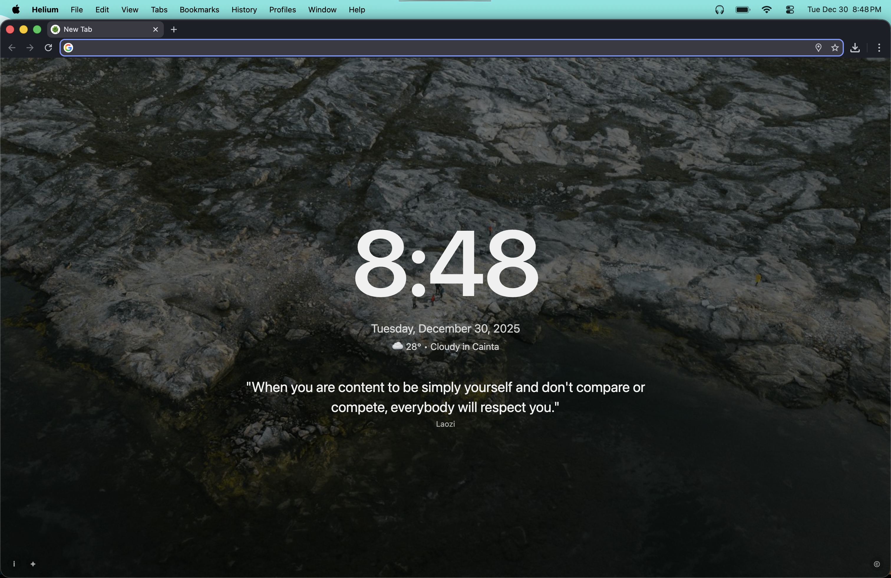
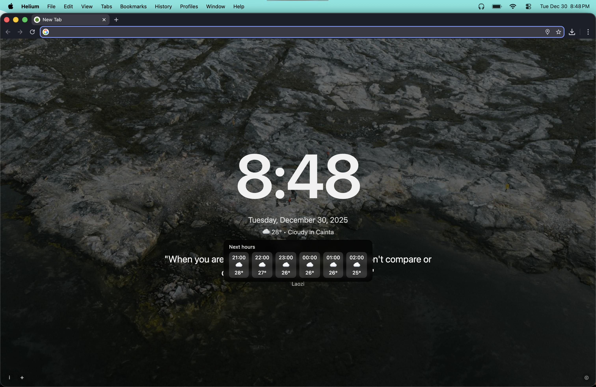
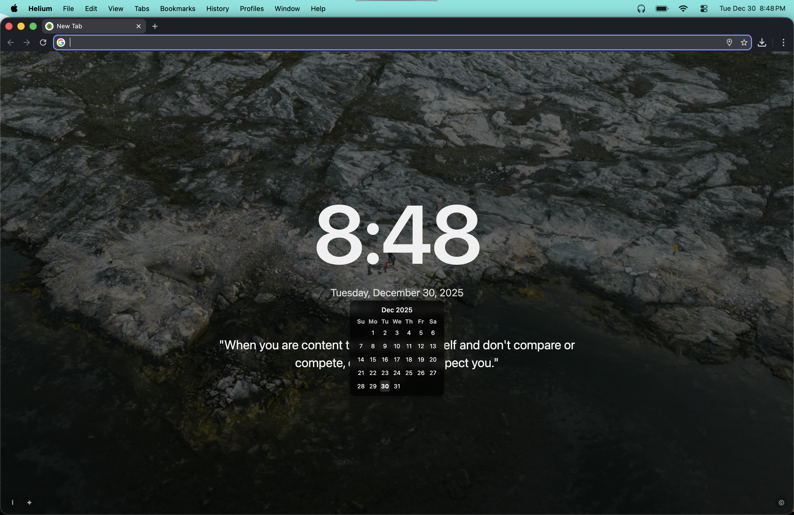

# Zen New Tab 🌿

A clean, minimal, and customizable new tab experience for your browser.

Zen New Tab replaces your default new tab with a calm interface featuring time, date, weather, daily quotes, and beautiful background images — all while respecting your privacy.

---

## ✨ Features

- 🕒 Live clock with smooth animations  
- 📅 Date display with calendar tooltip  
- 🌤 Local weather with hourly forecast tooltip  
- 🖼 Dynamic background images (cached locally)  
- 💬 Daily inspirational quotes  
- ✨ Optional particle animation effect  
- 🌙 Light & dark friendly minimal design  
- 🔒 Privacy-first (no tracking, no analytics)

---

## 📸 Screenshots

### Home / Default View


### Weather Widget


### Calendar Tooltip


---

## 🔐 Privacy

Zen New Tab does **not** collect, store, or sell personal data.

- No trackers  
- No analytics  
- No ads  
- No account required  

Weather and location data are used **only** to display local weather and are never stored remotely.

👉 Read the full Privacy Policy here:  
[Privacy Policy](https://geanpaulo19.github.io/zen-new-tab-privacy/privacy.html)

---

## 🚀 Installation

### Chrome / Chromium-based browsers

1. Download or clone this repository:
   ```bash
   git clone https://github.com/geanpaulo19/zen-new-tab.git
